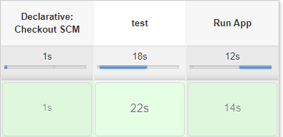
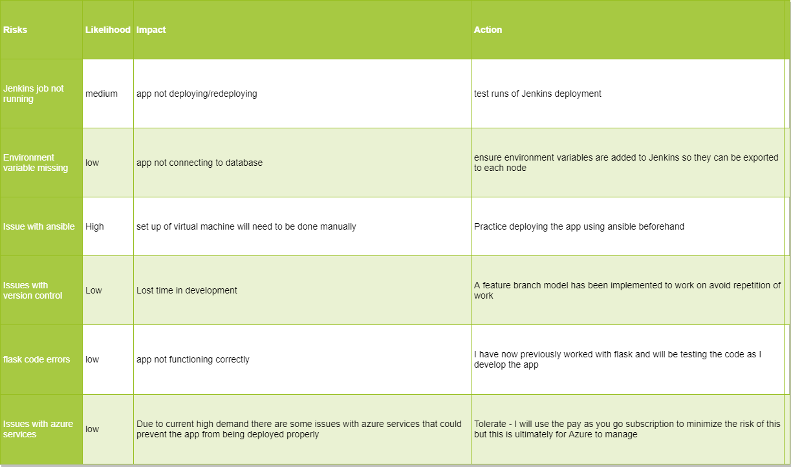
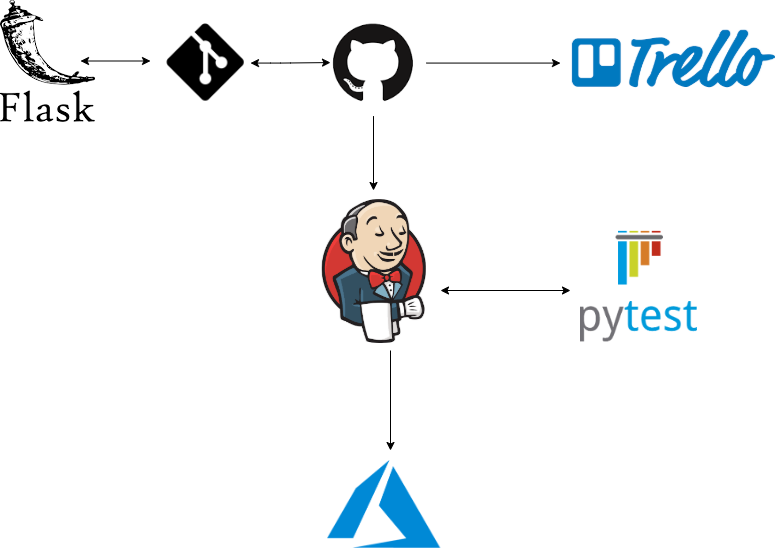

# Deployment steps

## Production

Requirements: Terraform, kubectl

To run the Kubernetes terraform files you will need to have a service principle set up and have the client id and client secret. 

If not these can be configured using the azure cli with\  

```az ad sp create-for-rbac --role="Contributor" --scopes="/subscriptions/your_subscription_id"```  

To link it to kubectl you will need to run\  

```echo "$(terraform output kube_config)" > ~/.kube/azurek8s```

Then terraform apply can be ran on the relevant folder\  

```cd ~/cards/terraform```  

```terraform init```  

```terraform apply```

Set kube config to deploy the cluster\  

```export KUBECONFIG=~/.kube/azurek8s```

The kubernetes cluster can now be deployed  

```cd ~/cards```  

```kubectl apply -f kubernetes```

# Cards microservice web application

## Brief
The objective of this project is to create a web application in python flask developed using mcroservices and for the app to have the capability to swap out services for alternatives with no downtime.

## Project
In order to do this I have decided to create an applicaiton that will create a deck of cards in a sql database, cards can be drawn using another service and  there will also be a service generating a random prize.

## Project tracking 

A [trello board](https://trello.com/b/8pupKc6i/cards) was used to track the project, this implemented the use of MoSCoW prioiritisation. the project placed a focus on deployment so I wanted a system that would allow me to see the key aspects before investing too much time in development.

## Services

### Database 

A container running mysql is first set up with an empty databse and table for the deck initialised inside of it. This is set up as an image and stored on docker hub.
 
### Reset
This is a Python service that connects to the SQL database, removes all entries for the deck table and then populates it  with entries representing a standard deck of cards.

V2 - Version2 of this service populates the database with the cards named in long form i.e "1" becomes "one" and "K" becomes "King"

### Draw 

This is another Python service that, provided the deck is not empty, will connect to the database delete a card from the deck at random and then return its value in JSON format, this service is currently hardcoded to draw two cards however this is set up in for loop so there is scope for it to draw a variable number of cards by accepting a variable containing the nuber of cards to be drawn as the app develops.

### Prize

This service uses python to generate a random number between 1 and 50 and returns it in JSON format.

V2 - Version2 of this service generates a random number between 51 and 100 and returns it in JSON format.

### Frontend 

This service displays a index.html page and has routes that when reached via links on the index.html, trigger get requests to the various other services. In the case of the draw and prize service the JSON values are returned, values from these are then passed to the index.html using flasks render template function, these values can then be displayed using Jinja2 syntax.

### nginx

An nginx service is also set up which directs traffic arriving on port 80 to the frontend service, the frontend service then communicates with all other services in the docker compse network removing the need to expose any ports other than 80 on this machine.

## Testing

Tests where conducted at an induvidual level for the services. See examples below:


Jenkins is also set up to run tests from the frontend before redeploying the app so the app will only be redeployed if the tests are passed.




## Risk assesment

Key risks and actions were identified in the table below.



## Deployment

Jenkins will be used on one VM to run a pipeline job, this will run the tests in the application and if they pass, the app will be deployed across two other VM's using docker stack deploy. A webhook will also be set up so that if the version number changes on github jenkins will re-reun the tests and redeploy however this time, where applicable the alternative versions of the app will be pulled form docker hub and phased into the deployment with no downtime.

### CI Pipeline

The below image describes the CI pipline for the project.



## Sprints

### Sprint 1

The aim of sprint 1 was to create a minimum viable product in ters of the code that is to say have a functioning app with multiple services communicating with each other through json files and database connections.

### Sprint 2 

During sprint 2, once the mvp was developed in terms of the flask code, I turned my attention to deployment, the services where built into images and pushed to docker hub, I linked the ssh keys across virtual machines as needed on azure and confgured a jenkins pipeline job to run frontend tests and deploy the app using a docker swarm stack deploy. The swarm makes use of one master node and one worker node and a seperate jenkins virutal machine connects to the master node to deploy the app.

### Sprint 3 

The project requirements placed a focus on the deployment of the app over the codebase whoever given more time it would be possible to continue developing the app into various casino games such as blackjack or ppoker, the microservices approach allows the flexibility of building additional services independently of the currnent app, for instance the draw service currently picks out 2 cards and is hardcoded to do this in a for loop. however a variable could easily be used to determine the number of cards to draw and retrun that number of cards as needed for each part of the game.


